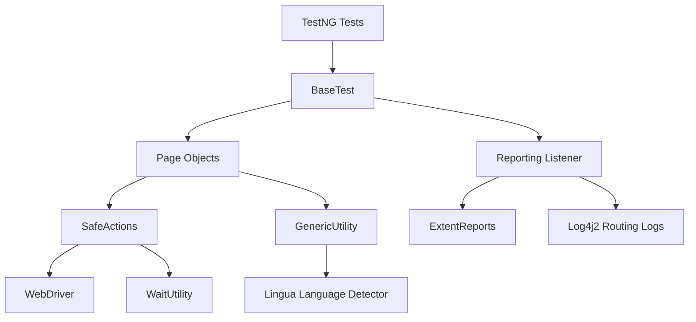
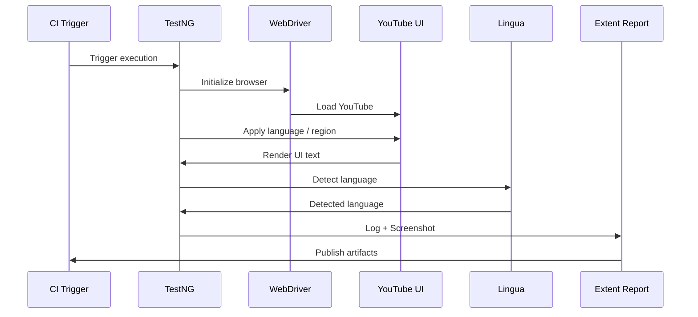
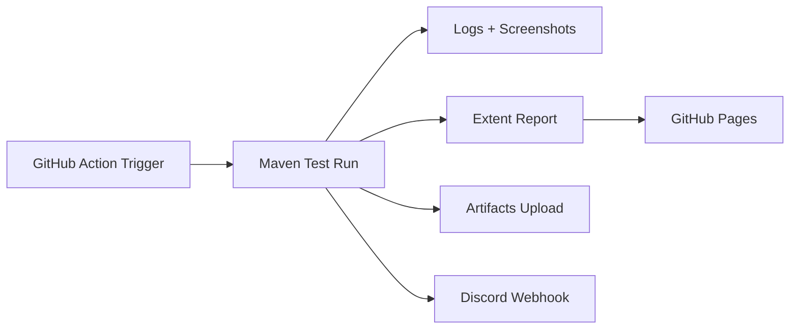

# 🎥 YouTube Multi-Language UI Validator Automation

A **production-grade end-to-end UI automation framework** engineered to **validate YouTube’s multi-language behavior across UI surfaces, menus, filters, and regional settings**.

This project is intentionally designed to behave like a **software system**, not a loose collection of Selenium scripts.  
It validates **language correctness, localization integrity, and regional behavior** using **real browser sessions**, **real UI text**, and **language detection intelligence**.

Every interaction is **safely executed**, **fully logged**, **screenshot-captured**, and **reported**, with **CI intelligence and public report hosting** built in.

---

## 📌 What This Project Validates

This framework performs **real-world validation** of YouTube’s UI across multiple languages and regions:

- Side menu language correctness (expanded & collapsed)
- Settings menu localization
- Global filter localization on search results
- `<html lang>` attribute correctness
- Region → country code mapping on YouTube logo
- Language correctness via **automatic language detection**
- UI stability across screen sizes and layouts

All validations are **data-driven**, **configuration-controlled**, and **CI-aware**.

---

## 🧠 Why This Project Stands Out

This project demonstrates:

- How to design **UI automation as a maintainable system**
- How to test **highly dynamic, real-world SPAs**
- How to build **deep observability** into automation
- How to validate **language correctness beyond string matching**
- How to integrate **CI, reporting, and notifications cleanly**

---

## 📑 Table of Contents

- Technology Stack
- Key Highlights
- Architecture
- Architecture Diagrams
- Execution Flow
- Language Intelligence (Lingua)
- CI & Reporting Intelligence
- Discord Notifications
- Folder Structure
- Running Tests
- Engineering Decisions Explained
- Extending the Framework
- Troubleshooting

---

## 🧰 Technology Stack

### Core Language & Build
- **Java 21**
- **Maven**

### Browser Automation
- **Selenium 4.27**
- **WebDriverManager**
- Chrome, Firefox, Edge
- Configurable headless, GPU, sandbox, extensions

### Test Execution Engine
- **TestNG 7.10**
  - Parallel execution
  - Retry analyzers
  - Custom listeners
  - Suite-based execution

### Data & Configuration
- **Apache POI** (Excel-driven tests)
- Centralized `masterdata.properties`
- Environment variable overrides
- CI-trigger-aware configuration

### Stability & Reliability Layer
- **SafeActions (custom abstraction)**:
  - Intelligent retries
  - JS click fallback
  - Page refresh recovery
  - Centralized waits
  - Structured logging

### Language Intelligence
- **Lingua Language Detector**
  - Detects real language from UI text
  - Validates localization correctness
  - Prevents partial-translation false positives

### Logging & Diagnostics
- **Log4j2 Routing Appender**
  - Per-test logs
  - Per-run folders
  - Thread-safe logging

### Reporting
- **ExtentReports (Spark HTML)**
  - Embedded screenshots
  - Linked logs
  - Failure stack traces
  - Public hosting compatible

### CI/CD & DevOps
- **GitHub Actions**
  - Push
  - Pull Request
  - Manual dispatch
  - Nightly CRON
- Artifact storage
- GitHub Pages hosting

### Notifications
- **Discord Webhooks**
  - Start & completion alerts
  - Status indicators
  - Direct links to reports

---

## ✨ Key Highlights

### 🧾 Fully Isolated Per-Run Artifacts

Each execution produces clean, timestamped artifacts:

```
logs/run_<timestamp>/<testName>.log

test-output/screenshots/Run_<timestamp>/<testName>/<step>.png
```

No log mixing. No ambiguity.

---

### ⚙️ Configuration-Driven Execution

Execution depth is centrally controlled:

- Fast runs for pushes
- Deep coverage for nightly CRON
- No code changes required

---

### 🧠 CI-Aware Decision Making

The framework adapts based on trigger source:

| Trigger Type | Behavior |
|-------------|---------|
| Push / PR | Reduced language coverage |
| Nightly CRON | Full language & region validation |
| Manual | Developer-controlled |

---

### 🌍 Language Detection (Beyond Text Matching)

UI text is validated using **actual language detection**, not assumptions.

This catches:
- Mixed-language UIs
- Partial translations
- Incorrect `<html lang>` attributes

---

### 🌐 Public GitHub Pages Reports

The latest execution report is always browser-accessible:
- No downloads
- Shareable links
- Embedded screenshots and logs

---

## 🏗 Architecture

### High-Level Architecture

```
Tests (TestNG)
  |
BaseTest
  |
Page Objects (YouTube UI)
  |
SafeActions (Resilience Layer)
  |
Driver + Utilities
  |
Lingua (Language Detection)
  |
Logging & Reporting
```

---

## 📐 Architecture Diagrams

### 1️⃣ System Layered Architecture



### 2️⃣ Execution & Observability Flow



### 3️⃣ CI & Notification Architecture



---

## 🔁 Execution Flow

```
CI Trigger (Push / CRON / Manual)
        |
Load configuration
        |
Initialize WebDriver
        |
Open YouTube
        |
Iterate languages / regions
        |
Apply UI actions safely
        |
Extract UI text
        |
Detect language & attributes
        |
Validate expected data
        |
Capture screenshots
        |
Generate logs & report
        |
Publish artifacts
        |
Notify Discord
```

---

## 🧪 Language Intelligence (Lingua)

The framework uses Lingua to:

- Detect the actual language rendered in UI text
- Compare against expected language mappings
- Validate `<html lang>` attribute
- Detect localization regressions early

This approach is far stronger than string comparison.

---

## 📦 Folder Structure

```bash
yt_multi_language_ui_validator/
│
├── base/
│   ├── BaseTest.java
│   └── BasePage.java
│
├── driverManager/
│   └── DriverManager.java
│
├── config/
│   └── ConfigManager.java
│
├── pages/
│   ├── YtLandingPage.java
│   └── YtInnerPage.java
│
├── safeActions/
│   └── SafeActions.java
│
├── utilities/
│   ├── GenericUtility.java
│   ├── WaitUtility.java
│   └── ScreenshotUtil.java
│
├── lingua/
│   └── LinguaHelper.java
│
├── reporting/
│   ├── ExtentManager.java
│   ├── ExtentTestManager.java
│   └── TestListener.java
│
├── logger/
│   ├── LogFolderSetup.java
│   └── LoggerUtility.java
│
├── test/
│   ├── tests/
│   │   └── YtMasterTests.java
│   ├── retry/
│   │   └── RetryFailedTest.java
│   └── runners/
│
├── resources/
│   ├── data/*.xlsx
│   └── masterdata.properties
│
└── .github/workflows/master.yml
```

---

## ▶️ Running Tests

### Quick Smoke Run

```bash
mvn clean test
```

### Reduced Language Coverage

```bash
mvn clean test -DrunForAllLanguages=false
```

### Full Language Regression

```bash
mvn clean test -DrunForAllLanguages=true
```

---

## 🧩 Engineering Decisions Explained

### SafeActions Abstraction

Centralizes all browser interactions to:

- Reduce flakiness
- Standardize retries
- Enable recovery via refresh
- Improve observability

### TestNG Over JUnit

Chosen for:

- Parallel execution
- Retry analyzers
- Listener ecosystem
- Suite flexibility

### ExtentReports Over Allure

- Self-contained HTML
- CI-friendly
- Screenshot-first debugging
- Easy GitHub Pages hosting

### Log4j2 Routing

- Per-test log isolation
- Clean debugging
- No cross-thread log pollution

### CI Mode Switching

- Fast feedback for developers
- Deep coverage for nightly runs
- Zero manual toggling

---

## ➕ Extending the Framework

- Add new UI checks in `GenericUtility`
- Extend Page Objects for new YouTube surfaces
- Add new language mappings via Excel
- Tune retries and waits centrally
- Enable new browsers via `DriverManager`

---

## 🛠 Troubleshooting

- CAPTCHA may appear on YouTube → retry usually resolves it
- Increase waits only when absolutely necessary
- Verify GitHub Pages deployment if report links fail
- Logs are always linked inside the Extent report

---

## 🏁 Final Note

This project reflects real-world automation engineering:

- Observable
- Configurable
- Resilient
- CI-native
- Debug-friendly

